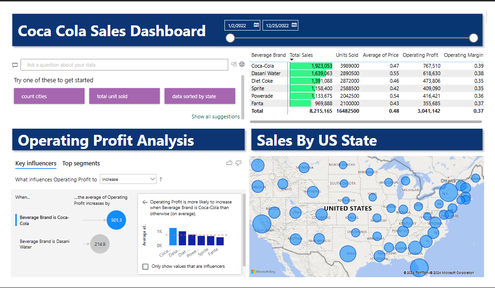

# 💡 Project Title: Coca-Cola Sales Dashboard (Power BI)

### 🚀 Description:
An interactive Power BI dashboard designed to analyze and visualize Coca-Cola’s sales performance across different regions, product categories, and time periods. This project highlights actionable insights on revenue trends, product performance, customer segments, and regional growth opportunities.

### 📊 Key Features:

1. Dynamic filters for region, year, and product type

2. KPIs tracking total sales, profit margin, and growth rate

3. Advanced DAX measures for accurate performance analysis

3. Engaging visuals (bar charts, line charts, maps, and cards)

4 .Data cleaning and modeling for smooth report performance

### 🧠 Skills & Tools Used:
Power BI | DAX | Data Modeling | Data Visualization | Business Intelligence

### 📈 Impact:
Delivered a clean, executive-level dashboard that enables data-driven decision-making and identifies top-performing products and markets.

### 👤 Author
**Mk Singh**  
💼 [LinkedIn](https://www.linkedin.com/in/mk-singh/)  
💻 [GitHub](https://github.com/mksingh)
